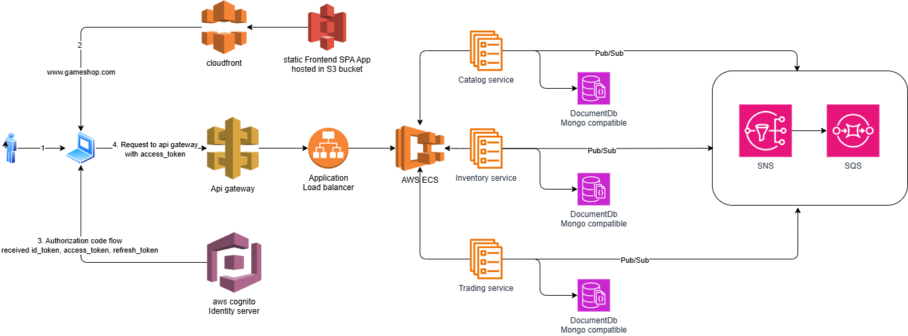

## Hello Everyone

Welcome to the GameShop organization! Here is an overview of our services:

### Play.Catalog
This project contains the Catalog service and related contracts for the GameShop solution.
- `Play.Catalog.Service`: The main Catalog microservice.
- `Play.Catalog.Contracts`: Shared contracts for Catalog events and messages.

### Play.Inventory
This project contains the Inventory service and related contracts for the GameShop solution.
- `Play.Inventory.Service`: The main Inventory microservice.
- `Play.Inventory.Contracts`: Shared contracts for Inventory events and messages.

### Play.Identity
This project contains the Identity service and related contracts for the GameShop solution.
- `Play.Identity.Service`: The main Identity microservice.
- `Play.Identity.Contracts`: Shared contracts for Identity events and messages.

### Play.Trading
This project contains the Trading service for the GameShop solution.
- `Play.Trading.Service`: The main Trading microservice.

### Play.Common
This project contains common interfaces, base classes, and utilities shared across GameShop microservices.
- Includes `IEntity`, `IRepository` interfaces, MongoDB and MassTransit extensions, and shared settings classes.

### Play.Frontend
React-based frontend for the Play Economy system.
- To build: `npm install`
- To run locally: `npm start` and navigate to http://localhost:3000.

### Play.Infra
This folder contains infrastructure and deployment resources for the GameShop solution.
- Includes `docker-compose.yml` for multi-service orchestration for local development.

